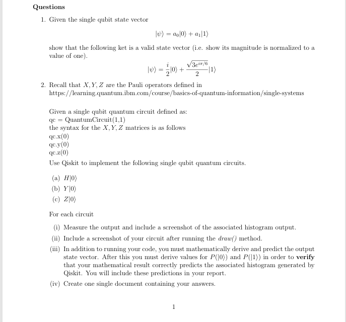

# Quantum-Computation_Assignment_2

The tested notebook environment is Python 3.11 in `.venv311`.
This environment reuses the installed Python 3.11 packages to conserve disk space.
In VS Code, use **Select Kernel → Python Environments → .venv311**
(`.venv311\Scripts\python.exe`), then **Restart Kernel** and **Run All**.
The older `.venv` uses Python 3.15 alpha and is not the tested environment.

To recreate the environment from a Python 3.11 installation:

```powershell
py -3.11 -m venv --system-site-packages .venv311
.\.venv311\Scripts\python.exe -m pip install -r requirements.txt
.\.venv311\Scripts\python.exe -m ipykernel install --sys-prefix --name quantum-assignment-2 --display-name "Quantum Assignment 2 (Python 3.11)"
```

The assignment files are [Assignment2_Quantum_Circuits.ipynb](Assignment2_Quantum_Circuits.ipynb)
and the PDF report [Kabore_Albert_Module_2_Assignment.pdf](Kabore_Albert_Module_2_Assignment.pdf).
The report includes the normalization proof, H/Y/Z derivations, runnable code with
matching outputs, circuit diagrams, measurement histograms, and comparison with
predicted probabilities. The igures folder contains notebook outputs.

The original assignment screenshot is available in the VS Code project as
[figures/assignment_instructions.png](figures/assignment_instructions.png).


